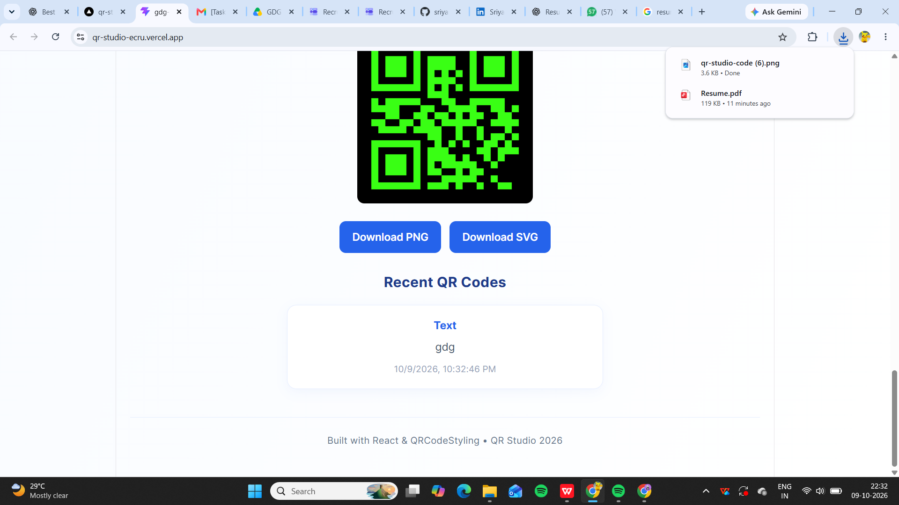

# QR Studio

QR Studio is a modern QR Code Generator built with React and Vite. It allows users to create, customize, preview, and download QR codes for multiple use cases including URLs, Text, Email, Phone Numbers, and Wi-Fi credentials.

## Features

- Generate QR Codes for:
  - URLs
  - Plain Text
  - Email
  - Phone Numbers
  - Wi-Fi Networks

- QR Customization:
  - Change QR Size
  - Foreground Color Selection
  - Background Color Selection
  - Adjustable Margin
  - Error Correction Levels

- Theme Presets:
  - Classic
  - Dark
  - Ocean
  - Neon

- Download Options:
  - PNG Format
  - SVG Format

- Validation:
  - URL Validation
  - Email Validation
  - Phone Number Validation
  - Wi-Fi SSID Validation

- Scan Reliability Warning:
  - Alerts users when foreground and background colors may affect QR scan accuracy.

- Recent QR History:
  - Stores the last 5 generated QR codes using Local Storage.

- Responsive Design:
  - Optimized for Desktop, Tablet, and Mobile devices.

## Tech Stack

### Frontend
- React.js
- Vite
- JavaScript
- CSS3

### Libraries
- qr-code-styling
- React Hooks (useState, useEffect, useRef)

### Browser Storage
- Local Storage

## Project Structure

```bash
src/
│
├── components/
│   ├── QRForm.jsx
│   ├── QRPreview.jsx
│   ├── CustomizationPanel.jsx
│   ├── Presets.jsx
│   └── RecentQR.jsx
│
├── App.jsx
├── App.css
├── index.css
└── main.jsx
```

## Installation

Clone the repository:

```bash
git clone https://github.com/your-username/qr-studio.git
```

Navigate to the project directory:

```bash
cd qr-studio
```

Install dependencies:

```bash
npm install
```

Run the development server:

```bash
npm run dev
```

Build for production:

```bash
npm run build
```

Preview production build:

```bash
npm run preview
```

## How It Works

1. Select a QR Code type.
2. Enter the required information.
3. Customize the appearance of the QR code.
4. Preview the generated QR code instantly.
5. Download the QR code as PNG or SVG.
6. Access recently generated QR codes from history.

## Future Enhancements

- Logo Embedding
- QR Templates
- Analytics Tracking
- Dark Mode Toggle
- QR Sharing Functionality
- Export History as PDF

## Author

Sriya Sahu

SRM Institute of Science and Technology

B.Tech Computer Science Engineering

## License

This project is developed for educational and learning purposes.